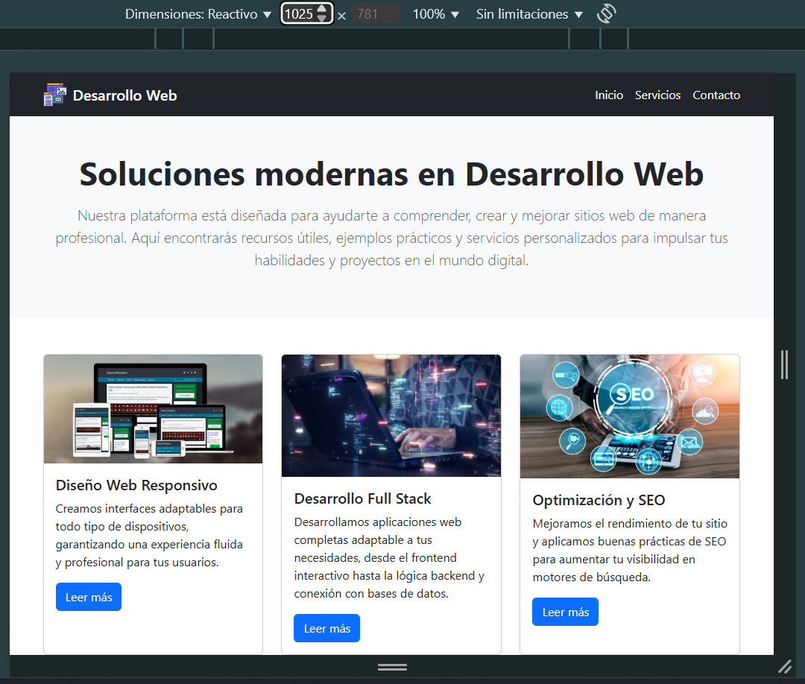
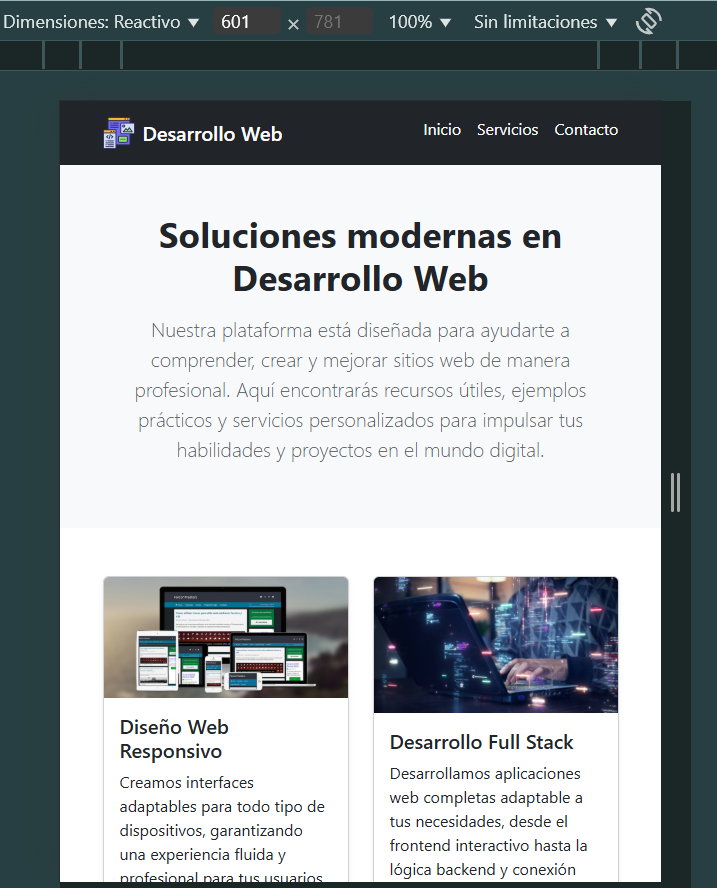
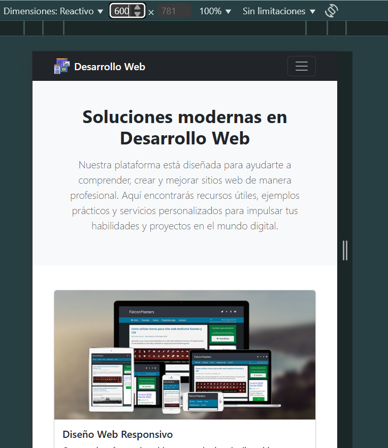

# Desarrollo Web - Proyecto Responsivo

Este es un proyecto creado con **React + Vite** que implementa un diseño responsivo con **Bootstrap** y CSS personalizado.  
Incluye un sistema de tarjetas (cards) que se ajusta según el tamaño de la pantalla y un menú de navegación adaptable tipo **hamburguesa**.

---

## Vista previa

### Versión Escritorio (>1024px)

### Versión Tabletas (601 - 1024px)

### Versión Móvil (≤600px)

> **Nota:** Cambia las rutas de las imágenes por las que tengas en tu carpeta `assets`.

---

## Características
- **Navbar responsivo** que se convierte en menú hamburguesa en móviles.
- **Cards adaptables**:  
  - 1 columna en ≤600px  
  - 2 columnas en 601–1024px  
  - 3 columnas en >1024px
- Ajuste dinámico de tipografía y márgenes para mejor legibilidad.
- Efectos hover en enlaces y tarjetas.

---

## 🛠 Tecnologías utilizadas
- [React](https://react.dev/)
- [Vite](https://vitejs.dev/)
- [Bootstrap 5](https://getbootstrap.com/)
- CSS personalizado con media queries

